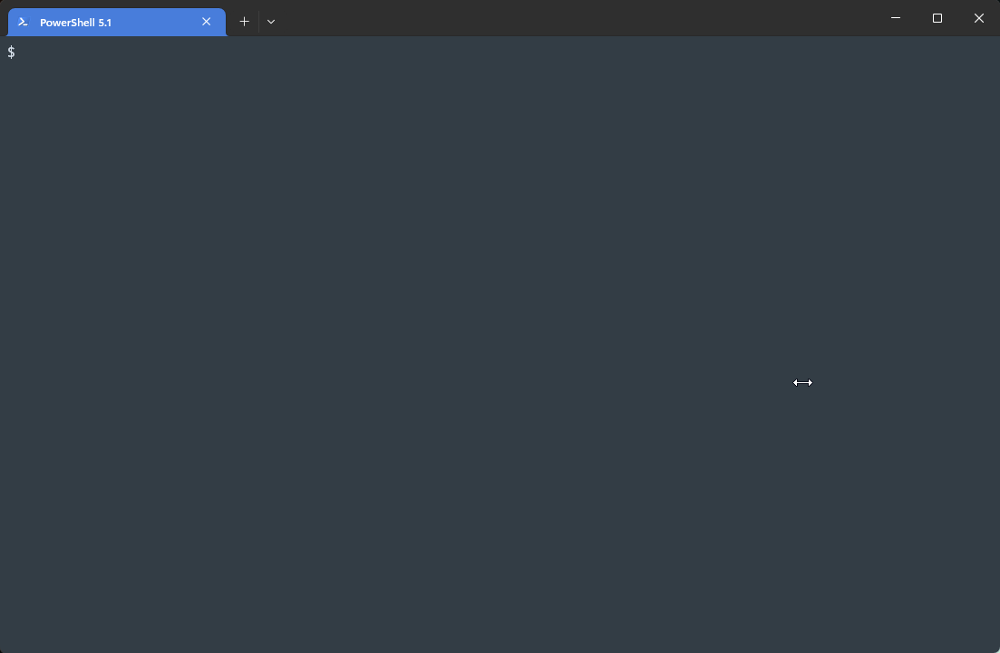

# passhash

[](https://github.com/ReK42/passhash/blob/main/LICENSE)
[](https://pypi.python.org/pypi/passhash)
[](https://pypi.python.org/pypi/passhash)
[](https://pypi.python.org/pypi/passhash)
[](https://github.com/ReK42/passhash/commits/main)
[](https://github.com/ReK42/passhash/actions)
[](https://github.com/astral-sh/ruff)
[](https://github.com/psf/black)

Generate password hashes based on various standards. Most UNIX crypt standards are
supported, along with a selection of Microsoft, Cisco, and LDAP-based standards.

## Installation

```
pipx install passhash
```

## Usage

By default, passhash will prompt for a password and generate a UNIX-style SHA2-512 hash:

`passhash`

```
Password:
┏━━━━━━━━━━━━━━┳━━━━━━━━━━━━━━━━━━━━━━━━━━━━━━━━━━━━━━━━━━━━━━━━━━━━━━━━━━━━━━━━━━━━━━━━━━━━━━━━━━━━━━━━━━━┳━━━━━━━━┓
┃ Method       ┃ Hash                                                                                      ┃ Time   ┃
┡━━━━━━━━━━━━━━╇━━━━━━━━━━━━━━━━━━━━━━━━━━━━━━━━━━━━━━━━━━━━━━━━━━━━━━━━━━━━━━━━━━━━━━━━━━━━━━━━━━━━━━━━━━━╇━━━━━━━━┩
│ sha512_crypt │ $6$rounds=656000$ohgWV4S9N2wPmYsN$7ZR6zmTAy5ePkrjnEnOUyOuF3pRE4TLvucwSs4AewUcOC59YawNkXap │ 0.559s │
│              │ AkqqUNJfcHuo0es6mGRQJO36EGz3aY/                                                           │        │
└──────────────┴───────────────────────────────────────────────────────────────────────────────────────────┴────────┘
```

A random password can be generated instead with the `--generate` option:

`passhash --generate`

```
Password: am3YVAbcMxK
┏━━━━━━━━━━━━━━┳━━━━━━━━━━━━━━━━━━━━━━━━━━━━━━━━━━━━━━━━━━━━━━━━━━━━━━━━━━━━━━━━━━━━━━━━━━━━━━━━━━━━━━━━━━━┳━━━━━━━━┓
┃ Method       ┃ Hash                                                                                      ┃ Time   ┃
┡━━━━━━━━━━━━━━╇━━━━━━━━━━━━━━━━━━━━━━━━━━━━━━━━━━━━━━━━━━━━━━━━━━━━━━━━━━━━━━━━━━━━━━━━━━━━━━━━━━━━━━━━━━━╇━━━━━━━━┩
│ sha512_crypt │ $6$rounds=656000$M4iIIAbmfVYVytIF$/MrspoGH6PMDq7IeS3RFPFhedUdGoYIddq7KAuYXAH4pYRI1Ge.3ykb │ 0.580s │
│              │ yO2PrTleh4kna.t22CnjefckO5XlyJ1                                                           │        │
└──────────────┴───────────────────────────────────────────────────────────────────────────────────────────┴────────┘
```

Additional parameters such as the salt can be specified, see `passhash --help` for the full list:

`passhash --generate --unix-md5 --salt secret`

```
Password: RvkrpxCR3uv
┏━━━━━━━━━━━┳━━━━━━━━━━━━━━━━━━━━━━━━━━━━━━━━━━┳━━━━━━━━┓
┃ Method    ┃ Hash                             ┃ Time   ┃
┡━━━━━━━━━━━╇━━━━━━━━━━━━━━━━━━━━━━━━━━━━━━━━━━╇━━━━━━━━┩
│ md5_crypt │ $1$secret$SmI5vW6El8fsZHapctHAl. │ 0.008s │
└───────────┴──────────────────────────────────┴────────┘
```

If a selected hash algorithm requires a username it will prompt for it:

`passhash --generate --windows-msdcc2`

```
Username: jsmith
Password: baQpwMueTKm
┏━━━━━━━━┳━━━━━━━━━━━━━━━━━━━━━━━━━━━━━━━━━━┳━━━━━━━━┓
┃ Method ┃ Hash                             ┃ Time   ┃
┡━━━━━━━━╇━━━━━━━━━━━━━━━━━━━━━━━━━━━━━━━━━━╇━━━━━━━━┩
│ msdcc2 │ 254bbbbd2da9a0bd48681f9a67e3ca44 │ 0.003s │
└────────┴──────────────────────────────────┴────────┘
```

One or more algorithms can be specified as runtime, see `passhash --help` for the full list:

`passhash --generate --unix-md5 --ldap-md5`

```
Password: aHMHCAXJMmP
┏━━━━━━━━━━━┳━━━━━━━━━━━━━━━━━━━━━━━━━━━━━━━━━━━━┳━━━━━━━━┓
┃ Method    ┃ Hash                               ┃ Time   ┃
┡━━━━━━━━━━━╇━━━━━━━━━━━━━━━━━━━━━━━━━━━━━━━━━━━━╇━━━━━━━━┩
│ ldap_md5  │ {MD5}8o3o/NROgZ6U55wxjuLoDw==      │ 0.000s │
│ md5_crypt │ $1$lUpHRYmh$yvlUtIwPk5p5kXoW6kJpu/ │ 0.001s │
└───────────┴────────────────────────────────────┴────────┘
```

Use `--all` to generate all supported hash algorithms:

`passhash --generate --all`



## Development Environment

```sh
git clone https://github.com/ReK42/passhash.git
cd passhash
pre-commit install
pip install -e .[tests]
```
